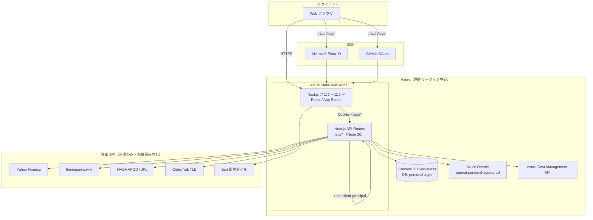
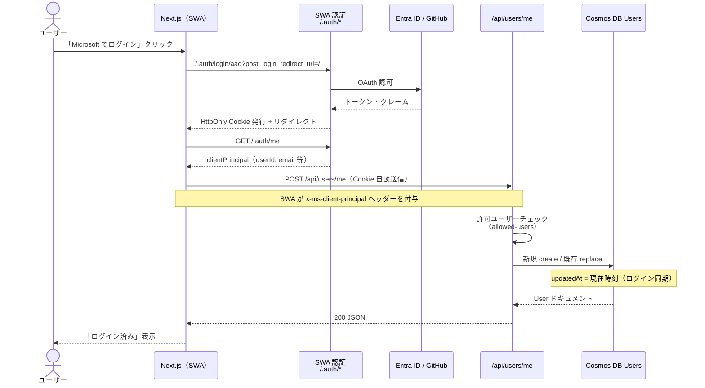
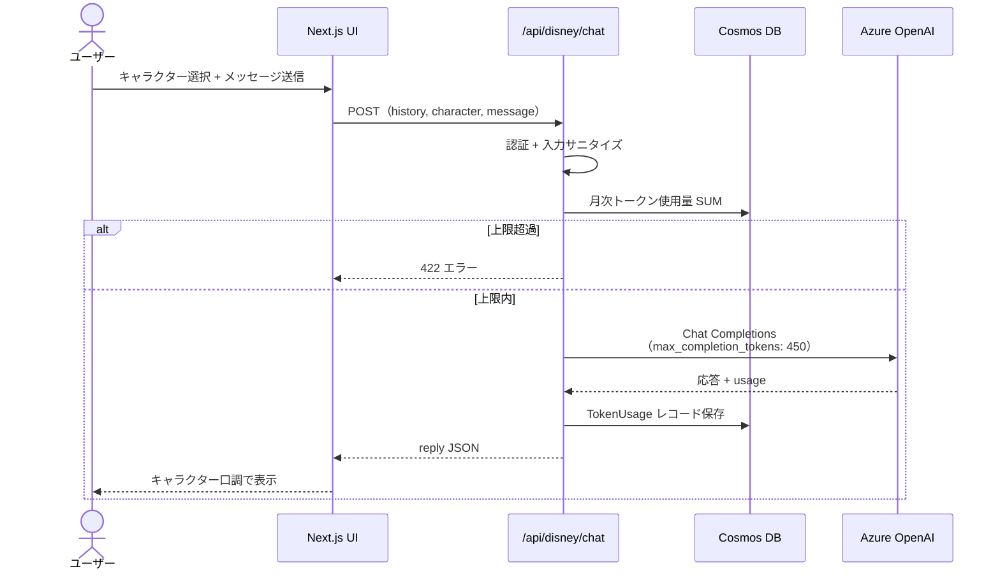

# AQUA Personal Apps — 基本設計書

> **プロジェクト名**: AQUA Information（ClaudeCodeWork / [mickey4world-rgb/AQUA](https://github.com/mickey4world-rgb/AQUA)）  
> **本番 URL**: https://www.aquacore.net  
> **最終更新**: 2026-08-21  
> **対象読者**: プロダクトオーナー・開発者・運用担当（非エンジニアでも全体像を把握できることを目的とする）

---

## 目次

1. [システム概要と特徴](#1-システム概要と特徴)
2. [アプリケーション一覧](#2-アプリケーション一覧)
3. [システム構成図](#3-システム構成図)
4. [インフラ・構成一覧](#4-インフラ構成一覧)
5. [データ構造（Cosmos DB）](#5-データ構造cosmos-db)
6. [認証の手順（データの流れ）](#6-認証の手順データの流れ)
7. [AI 利用とコスト管理](#7-ai-利用とコスト管理)
8. [セキュリティ対策](#8-セキュリティ対策)
9. [関連ドキュメント](#9-関連ドキュメント)

---

## 1. システム概要と特徴

### 1.1 目的

**AQUA Personal Apps** は、個人・家族向けの統合情報ポータルです。  
1 つのログイン（Microsoft Entra ID / GitHub）で、株価監視・ディズニー混雑分析・宇宙データ可視化・AI 合議・資料生成・コスト可視化など、複数のアプリを安全に利用できます。

### 1.2 設計思想（3 本柱）

| 柱 | 方針 | 実現方法 |
|---|---|---|
| **セキュリティ重視** | 未許可ユーザー・未認証 API を遮断 | SWA 組み込み認証、ルート保護、許可ユーザーホワイトリスト、CSP / セキュリティヘッダー、API アクセスログ |
| **低コスト** | 常時稼働サーバーを置かない | Azure Static Web Apps + Serverless Cosmos DB + 従量課金 OpenAI、月次トークン上限、短いプロンプト・履歴 |
| **データ国内保持** | ユーザーデータ・AI ログを日本国内に | Cosmos DB / Azure OpenAI を **Japan East**（または Japan West）に配置。国内限定 AI 合議モードで海外 API を使わない |

> プロジェクト固定ルールは [`.claudecode.json`](.claudecode.json) に定義されています。

### 1.3 技術スタック（概要）

| レイヤー | 技術 | 備考 |
|---|---|---|
| フロントエンド | **Next.js 16**（App Router）+ **React** + TypeScript + Tailwind CSS | ユーザー向け UI |
| 認証 | **Azure Static Web Apps 組み込み認証** | Microsoft Entra ID（`aad`）/ GitHub |
| バックエンド API | **Next.js Route Handlers**（`/app/api/*`） | SWA の Managed API（`node:20`）として実行 |
| データベース | **Azure Cosmos DB**（Serverless） | DB 名 `personal-apps`、パーティションキー `userId` |
| AI | **Azure OpenAI**（＋任意で OpenAI 直 API） | 機能ごとにデプロイメント指定 |
| CI/CD | GitHub Actions → Azure Static Web Apps | `main` ブランチ push で自動デプロイ |

> **補足**: 初期設計書（[`docs/DESIGN.md`](docs/DESIGN.md)）では独立した Azure Functions を想定していましたが、**現行実装では Next.js API Routes が SWA 上のサーバーレス API として動作**しています。機能的には「Functions 相当」の役割を担います。

---

## 2. アプリケーション一覧

| # | アプリ | パス | 主な機能 | 主なデータソース |
|---|---|---|---|---|
| 1 | **ポータル** | `/` | 全アプリへのダッシュボード | — |
| 2 | **保有株** | `/stocks` | 米国株・日本株ウォッチ、売買アドバイス、AI 分析 | Yahoo Finance、Cosmos DB |
| 3 | **ディズニー** | `/disney` | 混雑カレンダー、待ち時間、回り方アドバイス、キャラクターチャット | themeparks.wiki、Azure OpenAI |
| 4 | **AI 合議** | `/council` | 複数 AI が議論し合意回答を生成 | Azure OpenAI / OpenAI |
| 5 | **資料生成** | `/docs` | チャット指示から PowerPoint（pptx）生成 | Azure OpenAI |
| 6 | **宇宙分析** | `/space` | APOD タイムライン、小惑星 3D、**鷹の目**（衛星軌道・地上カメラ） | NASA APOD、JPL NeoWs、CelesTrak、Cesium |
| 7 | **コスト** | `/costs` | AI トークン消費・Azure インフラ実コスト可視化 | Cosmos DB、Azure Cost Management API |
| 8 | **設定** | `/settings` | 表示名・通知メールの更新 | Cosmos DB `Users` |

---

## 3. システム構成図

### 3.1 アーキテクチャ全体図



### 3.2 認証〜ユーザー同期シーケンス



### 3.3 AI 機能利用シーケンス（例: ディズニーチャット）



---

## 4. インフラ・構成一覧

### 4.1 Azure リソース

| リソース種別 | 名前（確定値） | プラン / SKU | リージョン | 用途 |
|---|---|---|---|---|
| リソースグループ | `rg-personal-apps-prod` | — | **Japan East**（設計方針） | 全リソースのグループ |
| Static Web Apps | `swa-personal-apps-prod` | Free / Standard | **East Asia** 等（CDN 配信） | フロント + API ホスティング |
| Azure OpenAI | `openai-personal-apps-prod` | 従量課金 | **Japan East** | チャット・合議・資料生成等 |
| Cosmos DB アカウント | `COSMOS_ENDPOINT` 環境変数で指定 | **Serverless** | **Japan East**（設計方針） | ユーザー・株・トークン・ログ |
| （任意）Cost Management | サブスクリプション全体 | Reader ロール | グローバル API | Azure 実コスト取得 |

> Cosmos DB アカウントの物理名は SWA のアプリケーション設定（`COSMOS_ENDPOINT`）で管理されます。DB 名は **`personal-apps`** です。

### 4.2 Cosmos DB コンテナ

| コンテナ名 | パーティションキー | 用途 | 実装状態 |
|---|---|---|---|
| `Users` | `/userId` | ユーザープロファイル | ✅ 利用中 |
| `StockWatches` | `/userId` | 株ウォッチ設定 | ✅ 利用中 |
| `TokenUsage` | `/userId` | AI トークン消費履歴 | ✅ 利用中 |
| `AccessLogs` | `/userId` | API アクセス監査ログ | ✅ 利用中 |

### 4.3 主要環境変数（SWA Application Settings）

| 変数 | 説明 |
|---|---|
| `COSMOS_ENDPOINT` / `COSMOS_KEY` | Cosmos DB 接続 |
| `COSMOS_DATABASE` | DB 名（既定: `personal-apps`） |
| `AZURE_OPENAI_ENDPOINT` | Azure OpenAI エンドポイント |
| `AZURE_OPENAI_API_KEY` | API キー |
| `AZURE_OPENAI_DEPLOYMENT` | 既定デプロイメント名 |
| `AZURE_OPENAI_REGION` | `japaneast` 等（国内保持チェック用） |
| `AZURE_SUBSCRIPTION_ID` | コスト API 用（任意） |
| `AZURE_TENANT_ID` / `CLIENT_ID` / `CLIENT_SECRET` | Cost Management SP（任意） |

### 4.4 デプロイパイプライン

| 項目 | 内容 |
|---|---|
| トリガー | `main` ブランチへの push |
| ワークフロー | [`.github/workflows/azure-static-web-apps.yml`](.github/workflows/azure-static-web-apps.yml) |
| ビルド | `frontend/` で `npm ci` → Next.js ビルド |
| デプロイ先 | Azure Static Web Apps |

---

## 5. データ構造（Cosmos DB）

### 5.1 Users コンテナ — JSON スキーマ

ログイン同期（`POST /api/users/me`）および設定画面で読み書きされるユーザードキュメントです。  
**最終ログイン相当のタイムスタンプは専用フィールドではなく `updatedAt` に記録**されます（ログインのたびに更新）。

| フィールド | 型 | 必須 | 説明 |
|---|---|:---:|---|
| `id` | string | ✓ | ドキュメント ID（= `userId`） |
| `userId` | string | ✓ | SWA `clientPrincipal.userId`（**パーティションキー**） |
| `email` | string | ✓ | ログインメールアドレス |
| `displayName` | string | ✓ | 表示名 |
| `authProvider` | string | ✓ | 認証プロバイダ（`aad` / `github` 等） |
| `notifyEmail` | string | ✓ | 通知先メール（未設定時は `email` と同じ） |
| `monthlyTokenLimit` | number | ✓ | 月次 AI トークン上限（既定: **100,000**） |
| `createdAt` | string (ISO 8601) | ✓ | 初回登録日時 |
| `updatedAt` | string (ISO 8601) | ✓ | 最終更新日時（**ログイン同期のたびに更新**） |

**サンプル JSON**

```json
{
  "id": "a1b2c3d4-e5f6-7890-abcd-ef1234567890",
  "userId": "a1b2c3d4-e5f6-7890-abcd-ef1234567890",
  "email": "aquaiot@outlook.com",
  "displayName": "Mickey",
  "authProvider": "aad",
  "notifyEmail": "aquaiot@outlook.com",
  "monthlyTokenLimit": 100000,
  "createdAt": "2026-07-15T03:20:00.000Z",
  "updatedAt": "2026-08-07T09:30:00.000Z"
}
```

**初回ログイン時の特殊処理**

- 事前 seed ユーザー（`user-mickey` 等）が存在する場合、Entra ID の `userId` へ **マイグレーション** してから利用開始します（[`frontend/lib/server/users.ts`](frontend/lib/server/users.ts)）。

### 5.2 その他コンテナ（概要）

<details>
<summary><strong>StockWatches</strong> — 株ウォッチ設定</summary>

| フィールド | 型 | 説明 |
|---|---|---|
| `id` | string | UUID |
| `userId` | string | パーティションキー |
| `ticker` | string | 銘柄コード |
| `market` | `"us"` \| `"jp"` | 市場 |
| `buyPrice` | number | 取得単価 |
| `shares` | number | 株数 |
| `targetMultiplier` | number | 目標倍率 |
| `targetPrice` | number | 目標株価 |
| `isActive` | boolean | 監視 ON/OFF |
| `createdAt` / `updatedAt` | string | タイムスタンプ |

</details>

<details>
<summary><strong>TokenUsage</strong> — AI トークン消費</summary>

| フィールド | 型 | 説明 |
|---|---|---|
| `id` | string | UUID |
| `userId` | string | パーティションキー |
| `feature` | string | 機能 ID（`disney-chat`, `stock-analysis` 等） |
| `model` | string | 使用モデル名 |
| `promptTokens` | number | 入力トークン |
| `completionTokens` | number | 出力トークン |
| `totalTokens` | number | 合計 |
| `estimatedCostUsd` | number | 推定コスト（USD） |
| `createdAt` | string | 記録日時 |

</details>

<details>
<summary><strong>AccessLogs</strong> — API 監査ログ</summary>

| フィールド | 型 | 説明 |
|---|---|---|
| `id` | string | UUID |
| `userId` | string | パーティションキー |
| `app` | string | `stocks` / `disney` / `costs` 等 |
| `method` | string | HTTP メソッド |
| `path` | string | API パス |
| `statusCode` | number | レスポンスコード |
| `durationMs` | number | 処理時間 |
| `createdAt` | string | 記録日時 |

</details>

---

## 6. 認証の手順（データの流れ）

ユーザーが **ログインボタンを押してから、Cosmos DB のログイン日時（`updatedAt`）が更新されるまで** の流れです。

### 6.1 ステップ一覧

1. **ログインボタン押下**  
   ユーザーが `/login` またはホームの「Microsoft でログイン」「GitHub でログイン」をクリックする。

2. **SWA 認証エンドポイントへリダイレクト**  
   ブラウザは `/.auth/login/aad` または `/.auth/login/github` に遷移する（[`frontend/lib/auth.ts`](frontend/lib/auth.ts)）。

3. **IdP 認証（Entra ID / GitHub）**  
   Microsoft または GitHub のログイン画面で資格情報を入力し、OAuth 認可を完了する。

4. **HttpOnly Cookie の発行**  
   Azure Static Web Apps がセッション Cookie を発行し、`post_login_redirect_uri`（通常 `/`）へリダイレクトする。  
   **JavaScript からトークンを直接扱わない** 設計。

5. **クライアント側で principal 取得**  
   フロントエンド（[`AuthStatus`](frontend/components/AuthStatus.tsx)）が `GET /.auth/me` を呼び、`clientPrincipal`（`userId`, `userDetails`, `identityProvider`, `claims`）を取得する。

6. **許可ユーザーチェック（第 1 関門）**  
   [`allowed-users.ts`](frontend/lib/allowed-users.ts) のホワイトリスト（`aquaiot`, `aya_tink`, `guest_free77`）と照合。  
   不一致の場合は「アクセス拒否」UI を表示し、以降の API は呼ばない。

7. **保護ルートの middleware チェック（第 2 関門）**  
   `/stocks`, `/disney`, `/space` 等へアクセスする際、[`middleware.ts`](frontend/middleware.ts) が Cookie 由来の `x-ms-client-principal` を検証。  
   未認証・未許可は `/login` へリダイレクト。

8. **API ルートの認証（第 3 関門）**  
   `/api/*` 呼び出し時、SWA が `x-ms-client-principal` ヘッダーを API に付与。  
   [`requireAllowedAuth`](frontend/lib/server/auth.ts) が 401 / 403 を返す。

9. **ユーザー同期 API 呼び出し**  
   - まず `GET /api/users/me` で既存ユーザーを検索  
   - 未登録なら `POST /api/users/me` → [`syncUser()`](frontend/lib/server/users.ts) 実行

10. **Cosmos DB への書き込み**  
    - **新規**: `Users` コンテナにドキュメント `create`（`createdAt`, `updatedAt` = 現在時刻）  
    - **既存**: `replace` で `email`, `authProvider`, **`updatedAt`（= 最終ログイン同期時刻）** を更新

11. **画面反映**  
    ホームまたは設定画面に「ログイン済み」、表示名・メール・登録日が表示される。

### 6.2 認可の多層防御（まとめ）

```
[ログインボタン]
    → SWA 組み込み認証（Entra / GitHub）
    → allowed-users ホワイトリスト（クライアント + API）
    → middleware（保護ページ）
    → staticwebapp.config.json allowedRoles: authenticated
    → API requireAllowedAuth
    → Cosmos DB userId パーティションでデータ分離
```

---

## 7. AI 利用とコスト管理

### 7.1 機能別 AI 利用

| 機能 | feature ID | 主なモデル | max_completion_tokens |
|---|---|---|---|
| ディズニーチャット | `disney-chat` | Azure OpenAI 既定デプロイ | 450 |
| 宇宙チャット | `space-chat` | 同上 | 500 |
| APOD 日本語解説 | `space-apod-ja` | 同上 | 600 |
| 株 AI アドバイス | `stock-analysis` | 同上 | 700 |
| 資料生成 | `docs-generate` | 同上 | 1,500 |
| AI 合議 | `council-*` | Azure / OpenAI 複数 | 深度依存 |
| 合議フォローアップ | `council-followup` | 同上 | 300 |

### 7.2 低コスト施策

| 施策 | 内容 |
|---|---|
| 月次上限 | ユーザーごと `monthlyTokenLimit`（既定 10 万 tokens）超過で AI 停止 |
| 短い履歴 | チャット履歴は直近 **4 件** のみ送信 |
| 短い system prompt | キャラクター別プロンプトをコンパクト化 |
| Serverless DB | Cosmos DB は RU 従量、待機コスト最小 |
| コスト可視化 | `/costs` で TokenUsage + Azure Cost Management を一覧 |

---

## 8. セキュリティ対策

| カテゴリ | 対策 |
|---|---|
| **A01 アクセス制御** | SWA 認証 + 許可ユーザーホワイトリスト + ルート `allowedRoles` |
| **A02 設定ミス** | 秘密情報は環境変数のみ（コード直書き禁止） |
| **A03 インジェクション** | [`security.ts`](frontend/lib/server/security.ts) で入力長制限・制御文字除去 |
| **A05 セキュリティ misconfiguration** | CSP, `X-Frame-Options: DENY`, `nosniff`, `Referrer-Policy` |
| **A07 認証失敗** | 401 → `/login` リダイレクト（`staticwebapp.config.json`） |
| **A09 ログ監視** | `AccessLogs` コンテナに API 呼び出し記録 |
| **データ分離** | Cosmos DB パーティションキー `userId` — 他ユーザーデータへのアクセス防止 |

---

## 9. 関連ドキュメント

| ファイル | 内容 |
|---|---|
| [`docs/README_SETUP.md`](docs/README_SETUP.md) | 新 PC への環境構築手順 |
| [`docs/DESIGN.md`](docs/DESIGN.md) | 現行設計の差分更新付き設計書 |
| [`docs/SOLUNA_MODEL_ROUTING.md`](docs/SOLUNA_MODEL_ROUTING.md) | Soluna モデル自動ルーティング |
| [`docs/SOLUNA_AUTONOMOUS.md`](docs/SOLUNA_AUTONOMOUS.md) | Soluna 自律運用（討伐・Note・街・BOINC・bitFlyer） |
| [`.claudecode.json`](.claudecode.json) | プロジェクト固定ルール（リージョン・コスト・命名） |
| [`frontend/staticwebapp.config.json`](frontend/staticwebapp.config.json) | 認証ルート・セキュリティヘッダー |

---

*本書は Claude Code が構築した AQUA Personal Apps の現行実装に基づいて作成されています。Soluna 自律運用の最新差分は 2026-08-21 時点の [`docs/SOLUNA_AUTONOMOUS.md`](docs/SOLUNA_AUTONOMOUS.md) を参照。*
