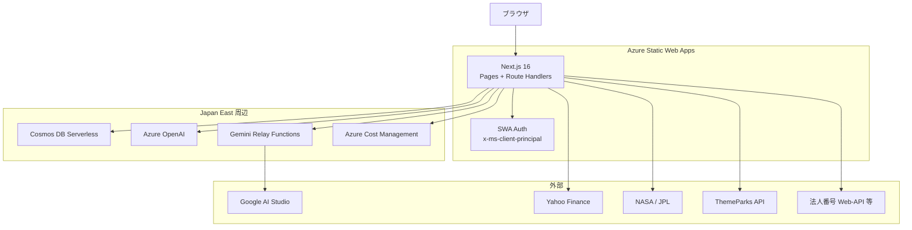
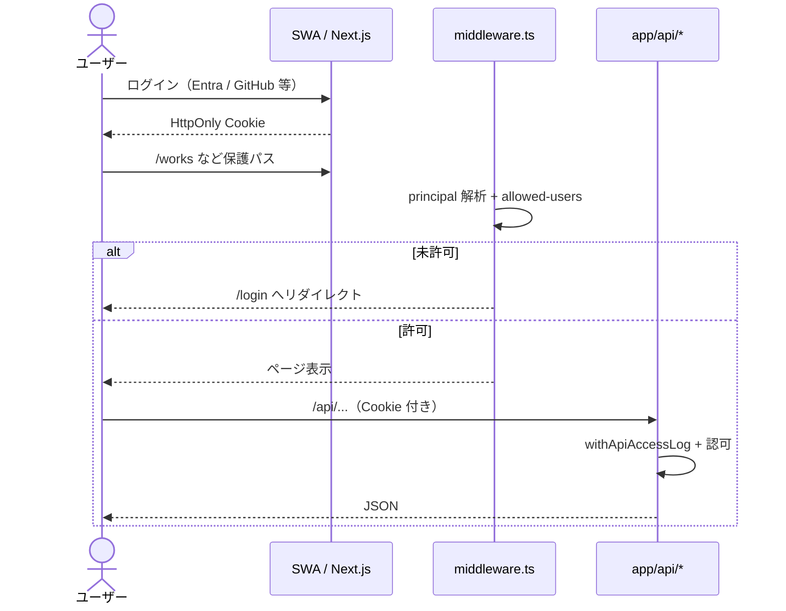

# システム設計書 — AQUA

> 最終更新: 2026-08-14  
> 対象リポジトリ: ClaudeCodeWork（プロダクト名: **AQUA**）  
> 本番 URL: https://www.aquacore.net  
> プロジェクトルール: `.claudecode.json` を参照（制約の要約。実装の正は本設計書と `frontend/`）

---

## 目次

1. [システム概要](#1-システム概要)
2. [技術スタック](#2-技術スタック)
3. [画面・ドメイン構成](#3-画面ドメイン構成)
4. [アーキテクチャ](#4-アーキテクチャ)
5. [API 概要](#5-api-概要)
6. [データ設計](#6-データ設計)
7. [AI 利用方針](#7-ai-利用方針)
8. [非機能要件](#8-非機能要件)
9. [リポジトリ構成](#9-リポジトリ構成)
10. [今後の拡張](#10-今後の拡張)

---

## 1. システム概要

### 目的

AQUA は個人向けの統合ダッシュボードである。  
Azure Static Web Apps 上の Next.js アプリとして、認証・複数ドメインのツール・AI 支援を一つのゲートウェイで提供する。

### プロダクト原則

- **個人利用**: 許可リストのログインのみ（SWA 認証 + `allowed-users`）
- **コスト極小**: Serverless / Free 枠優先、月次トークン上限、Gemini 無料枠の活用
- **データ配慮**: ユーザーデータは Cosmos（日本）。合議の国内限定モードは Japan East OpenAI のみ
- **体験**: トップや各アプリに「生きている」AI プレゼンス（コンパニオン、背景演出）

### ドメイン一覧（現行）

| ドメイン | ルート | 概要 |
|---|---|---|
| **Portal** | `/` | モジュール索引（07 Modules）、動的背景、**SHOWCASE** 導線 |
| **Showcase** | `/sample` | 認証不要の Studio デモ（6 モジュール体験） |
| **Works** | `/works/*` | AI 相談（図解ビューワー）、司法ノート、行政お金の流れ、資料生成 |
| **Stocks** | `/stocks` | 日米株ウォッチ + AI 売買アドバイス |
| **Disney** | `/disney` | TDR 混雑・待ち時間・キャラクターチャット |
| **Council** | `/council` | 複数 AI 合議（国内 / グローバル） |
| **Soluna** | `/soluna` | ソル（太陽）＋ルーナ（月）の育成型 AI コンパニオン |
| **Space** | `/space` | 望遠鏡タイムライン・小惑星 3D・鷹の目 |
| **Costs** | `/costs`, `/costs/access` | トークン・Azure 実績・**公開/内部アクセス分析** |
| **Settings / Login** | `/settings`, `/login` | プロファイル・認証入口 |

**認証不要（公開）**: `/`, `/sample`, `/login`  
**認証必須**: 上記以外の業務ドメイン（`middleware.ts` 参照）  
**例外**: `/api/soluna/shortcut/*` はショートカット用トークン認証（SWA ログイン不要）

---

## 2. 技術スタック

| レイヤー | 技術 | 備考 |
|---|---|---|
| **フロント / API** | Next.js **16**（App Router）+ React 19 + TypeScript + Tailwind CSS 4 | ページも API（`app/api/**/route.ts`）も同一アプリ |
| **ホスト** | Azure Static Web Apps（`swa-personal-apps-prod`） | `staticwebapp.config.json` で認証と `/api/*` |
| **DB** | Azure Cosmos DB Serverless（`personal-apps`） | パーティションキー概ね `userId` |
| **AI（課金）** | Azure OpenAI（Japan East ほか） | `openai` SDK |
| **AI（無料枠）** | Google Gemini（AI Studio） | SWA（East Asia）からは **Japan East 中継 Functions** 経由 |
| **株価** | `yahoo-finance2` | サーバ側 lookup |
| **3D / 地球** | Three.js + R3F、Cesium（鷹の目） | `satellite.js` |
| **可視化** | d3-sankey（お金の流れ） | |
| **資料 / エクスポート** | pptxgenjs、jspdf、html2canvas | WORKS 相談 MD/PDF/PPTX、Docs 資料 |

### Azure リソース命名

| リソース | 名前 |
|---|---|
| リソースグループ | `rg-personal-apps-prod` |
| Static Web App | `swa-personal-apps-prod` |
| Cosmos DB | `cosmos-personal-apps-prod` | DB: `personal-apps` |
| Gemini 中継 | `func-gemini-proxy-aqua`（Japan East） |

> **注**: `.claudecode.json` は歴史的に「Backend = Azure Functions」と記述しているが、**現行の業務 API は Next.js Route Handlers**。Functions は主に Gemini 中継などの補助用途。

---

## 3. 画面・ドメイン構成

### Works（`/works`）

| アプリ | パス | 状態 | 要点 |
|---|---|---|---|
| AI 相談ボード | `/works/consult` | 利用可 | Gemini。**AI 図解ビューワー**（構成図・フロー自動生成）、MD/PDF/PPTX 出力、メモ保存（`WorkNotes`） |
| 訴訟記録ノート | `/works/judicial/case-notebook` | 利用可 | NotebookLM 風。選択資料のみ AI へ。Gemini/OpenAI 切替。**Gemini 混雑時は OpenAI 自動フォールバック** |
| お金の流れ | `/works/admin/money-flow` | 利用可 | 行政事業レビュー支出のサンキー、支出先ドシエ |
| 資料生成スタジオ | `/works/misc/docs`（`/docs` も可） | 利用可 | pptx 生成・プレビュー |

### Showcase（`/sample` — 公開）

認証不要。7 モジュール（サンキー、訴訟記録、AI 合議、保有株、ディズニー、小惑星 3D、**Soluna**）のデモ UI。  
トップの **SHOWCASE** ボタンおよび `/login` から導線。

Soluna のモデル自動判断の詳細: [`docs/SOLUNA_MODEL_ROUTING.md`](./SOLUNA_MODEL_ROUTING.md)  
Soluna の朝パイプライン・街づくり・BOINC・資産運用: [`docs/SOLUNA_AUTONOMOUS.md`](./SOLUNA_AUTONOMOUS.md)

コストダッシュボード（`/costs`）の **Soluna 資産運用・BOINC** タブでも、魔力タンク台帳と BOINC 貢献の詳細を確認できます（`GET /api/costs/soluna-ops`）。

### Soluna（`/soluna`）

| 項目 | 内容 |
|---|---|
| キャラ | **ソル（Sol / ☀）** — 目標・タスク・成功・趣味を記憶 |
| | **ルーナ（Luna / 🌙）** — 感情・悩み・体調・癒やしを記憶 |
| AI | **Gemini / Azure OpenAI / Claude** を質問内容で自動切替（初期割当は別モデル）。ソル失敗時は即フェイルオーバー |
| 育成 | 親密度 0–100 → ステージ進行 + **知能 Lv.1〜3**（高親密度ほど最新・高性能モデル） |
| ニュース討伐 | 毎朝ニュースをモンスター化し、複数戦＋旅エリアで討伐。結果は Note 有料記事にも掲載 |
| 自律ジョブ | Note 公開 / BOINC→拠点都市開拓日誌 / 資産運用の裏稼働（市場パルス・取引所名は非公開） |
| リージョン | **海外リージョン可**（Soluna の Azure OpenAI は global エンドポイント） |
| Apple Watch | `POST /api/soluna/shortcut/chat` + `X-Soluna-Token`（ログイン不要） |

Cosmos: `SolunaRecords`（人間チャット + システム討伐・Note・BOINC・資産・街）、`SolunaTokens`（ショートカット用）  
Cron: GitHub Actions（Briefing 6/7/8/9時 JST 目標、Asset Trade 毎時）

司法サンプル: `frontend/data/judicial/samples/*.md`  
行政データ: `frontend/data/gyosei/*.json.gz` + `summary.json`

### Stocks（`/stocks`）

- ウォッチ CRUD、銘柄 lookup、AI アドバイス（Azure OpenAI）
- Cosmos: `StockWatches`

### Disney（`/disney`）

- ThemeParks 系待ち時間・混雑カレンダー
- キャラクター別チャット（Azure OpenAI）+ コンパニオン演出

### Council（`/council`）

- **国内限定**: Japan East OpenAI のみ（データ国内保持）
- **グローバル**: 最新デプロイ + Gemini「探査派」（global のみ）
- 合議 → フォローアップチャット

### Space（`/space`）

| タブ | 内容 |
|---|---|
| 望遠鏡タイムライン | NASA APOD、3D 宇宙位置、地球視点の波長分析、AI 解説 |
| 小惑星 3D | JPL CAD 接近一覧、JST 最接近、衝突確率（簡易+Sentry）、接近アニメで惑星同期、参考写真 |
| 鷹の目 | 衛星軌道・Cesium ビューア |

### Costs（`/costs`）

- 機能別トークン・推定コスト、Azure Cost Management 実績（設定時）
- **`/costs/access`**: 公開フロント（`/`, `/sample`, `/login`）の PV と内部 API アクセスをタブ分離表示

---

## 4. アーキテクチャ

### 全体構成



### 認証フロー



保護プレフィックス（`middleware.ts`）:  
`/stocks`, `/disney`, `/costs`, `/council`, `/soluna`, `/docs`, `/works`, `/space`, `/settings`

公開ページの PV は `PublicPageTracker` → `POST /api/analytics/pageview` → Cosmos `PageViewLogs`。

### デプロイ

- `main` への push → GitHub Actions「Azure Static Web Apps CI/CD」
- ローカル: `frontend/` で `npm run dev`、秘密情報は `.env.local`（`.env.local.example` 参照）

---

## 5. API 概要

すべて `frontend/app/api/**/route.ts`。認証必須ルートは SWA `allowedRoles: authenticated`。

| 領域 | 主なエンドポイント | 役割 |
|---|---|---|
| **users** | `GET /api/users/me` | プロファイル |
| **analytics** | `POST /api/analytics/pageview` | 公開ページ PV（認証不要） |
| **stocks** | `/api/stocks/watches`, `lookup`, `[id]` | ウォッチ・検索・詳細 |
| **disney** | `/api/disney/{chat,advice,waits,status,calendar}` | チャット・混雑 |
| **council** | `/api/council/{ask,ask/step,followup,config}` | 合議・設定 |
| **docs** | `POST /api/docs/generate` | pptx 生成 |
| **works** | `/api/works/consult`, `consult/export`, `summarize`, `notes`, `money-flow`, `money-flow/payee`, `judicial/case-chat` | 相談・図解エクスポート・メモ・行政・司法 |
| **soluna** | `/api/soluna/{state,chat}`, `/api/soluna/shortcut/chat` | コンパニオン・Watch 用 |
| **space** | `/api/space/apod`, `apod/summary`, `chat`, `neo`, `neo/image`, `eagle-eye/tracks` | 宇宙系 |
| **costs** | `/api/costs/{dashboard,azure-infra,access-analytics,public-access-analytics}` | コスト・分析 |
| **roles** | `/api/GetRoles` | SWA ロール補助 |

共通パターン:

- `withApiAccessLog` でアクセスログ（Cosmos `AccessLogs`）
- AI 呼び出し後 `recordTokenUsage`（`TokenUsage`）
- Azure OpenAI 利用時は `canUseAiTokens` で月次上限チェック

---

## 6. データ設計

### Cosmos コンテナ（現行）

| コンテナ | 用途 | セットアップ |
|---|---|---|
| `Users` | ユーザー、月次トークン上限など | `npm run seed:users` |
| `StockWatches` | 保有・監視銘柄 | （初回 API 利用時） |
| `TokenUsage` | AI トークン・推定コスト | `npm run setup:token-usage` |
| `AccessLogs` | 内部 API アクセス監査 | `npm run setup:access-logs` |
| `PageViewLogs` | 公開ページ PV（`/`, `/sample`, `/login`） | `npm run setup:page-view-logs` |
| `WorkNotes` | WORKS AI 相談メモ | `npm run setup:work-notes` |
| `SolunaRecords` | Soluna プロフィール・記憶・会話 | `npm run setup:soluna` |
| `SolunaTokens` | Apple Watch ショートカット用トークン | 同上 |

環境変数例: SWA アプリ設定または `frontend/.env.local`（ローカル）。  
主なキー: `COSMOS_*`, `GEMINI_*`, `AZURE_OPENAI_*`, `AZURE_FOUNDRY_CLAUDE_*`, `SOLUNA_*`, `GEMINI_RELAY_*`。

### リポジトリ同梱データ（サーバ読み取り）

| パス | 内容 |
|---|---|
| `frontend/data/gyosei/` | 行政事業レビュー支出（年次 gzip JSON + summary） |
| `frontend/data/judicial/samples/` | 架空民事の訴訟記録サンプル MD |

### 永続化しないもの（意図的）

- 訴訟記録ノートのアップロード本文 → **ブラウザセッションのみ**（送信時だけ API に載せる）
- 合議の添付・一時プロンプト → 永続化方針は機能ごとに限定

---

## 7. AI 利用方針

| 機能 | 既定プロバイダ | 備考 |
|---|---|---|
| WORKS 相談 / まとめ | Gemini | 無料枠。JSON で回答＋図解 spec。本番は中継必須 |
| 訴訟記録ノート | Gemini **または** Azure OpenAI | UI で切替。Gemini はリトライ・モデルフォールバック・OpenAI 自動切替 |
| **Soluna** | Gemini / Azure OpenAI / **Azure Claude (Foundry)** | 質問で自動ルーティング。親密度で知能 Lv.1〜3。Claude は Foundry 優先 |
| 株アドバイス・Disney・Space 解説・Docs | Azure OpenAI | |
| 合議（domestic） | Azure OpenAI Japan のみ | Gemini 不可 |
| 合議（global） | Azure OpenAI + Gemini 探査派 | |

### Gemini 耐障害

- `generateWithGemini`: 混雑・503 等で **最大 3 回リトライ**、`gemini-2.0-flash` / `gemini-1.5-flash` へフォールバック
- 環境変数 `GEMINI_FALLBACK_MODELS` で代替モデル列を上書き可

### リージョンと Gemini

- SWA 実行リージョンは East Asia になりやすく、Google が拒否するため **`GEMINI_RELAY_URL` / `GEMINI_RELAY_KEY`** で Japan East 中継する。
- ローカル（日本）では `GEMINI_API_KEY` 直叩き可。

### 免責（プロダクト）

- 訴訟記録ノート・行政ドシエ・小惑星衝突確率などは **学習・可視化用**。法的助言・公式予報の代替ではない。

---

## 8. 非機能要件

### セキュリティ

| 項目 | 方針 |
|---|---|
| 認証 | SWA 組み込み + HttpOnly Cookie |
| 認可 | `allowed-users` ホワイトリスト + API 側検証 |
| 秘密情報 | 環境変数 / Key Vault。リポジトリへ直書き禁止 |
| ヘッダ | middleware で CSP・nosniff・frame deny 等 |
| データ分離 | Cosmos は `userId` ベース |

### コスト

| ルール | 詳細 |
|---|---|
| Serverless 優先 | SWA / Cosmos Serverless / OpenAI 従量 |
| トークン上限 | ユーザー月次。超過時は課金 AI を抑制 |
| Gemini 優先箇所 | 日常相談・司法整理など無料枠向け |
| キャッシュ | APOD 等は `fetch` revalidate / クライアント要約キャッシュ |

### データ国内保持

| 対象 | 方針 |
|---|---|
| Cosmos・国内合議プロンプト | Japan East（または West）OpenAI |
| グローバル合議・Gemini | 国外処理があり得る。UI でモード明示 |
| SWA 静的配信 | CDN はグローバル。業務データは API/Cosmos 側で制御 |

---

## 9. リポジトリ構成

```
ClaudeCodeWork/
├── .claudecode.json          # プロジェクト制約（要約）
├── docs/DESIGN.md            # 本設計書
├── tools/                    # データ変換・調査スクリプト
└── frontend/                 # AQUA 本体
    ├── app/                  # ページ + API Routes
    ├── components/           # UI（works / space / council / soluna / showcase / …）
    ├── data/                 # gyosei / judicial samples
    ├── lib/
    │   ├── server/           # Cosmos, AI, ドメインロジック
    │   ├── types/            # 共有型
    │   └── *.ts              # クライアント/共有ユーティリティ
    ├── middleware.ts
    ├── staticwebapp.config.json
    └── .env.local.example
```

---

## 10. 今後の拡張

| 優先 | 候補 | メモ |
|---|---|---|
| 中 | 訴訟ノート PDF 入力 | v1 は txt/md のみ |
| 中 | Soluna Watch ネイティブ連携 | 現状は iPhone ショートカット + トークン API |
| 中 | 株アラートの定期実行 | 現状はオンデマンド中心 |
| 低 | Disney 予定の Cosmos 永続 | 現状はライブ API + チャット中心 |
| 継続 | 行政パネルの追加アプリ | ハッカソンアイデア等 |

---

## 変更履歴（設計書）

| 日付 | 内容 |
|---|---|
| 2026-07-31 | 初版（株・Disney・コスト中心、Functions 前提） |
| 2026-08-09 | AQUA 現行に再進化。Works/司法/行政/合議/Space、Next.js API、Gemini 中継 |
| 2026-08-14 | Soluna、Showcase（`/sample`）、WORKS 図解ビューワー、公開 PV 分析、Cosmos コンテナ追加、Gemini 耐障害、Apple Watch ショートカット API |
| 2026-08-21 | Soluna 自律運用を差分化ドキュメント化。ニュース複数戦・旅・Note・街づくり(BOINC)・資産運用裏稼働・朝4枠schedule・ソル即フェイルオーバー（[`SOLUNA_AUTONOMOUS.md`](./SOLUNA_AUTONOMOUS.md)） |
