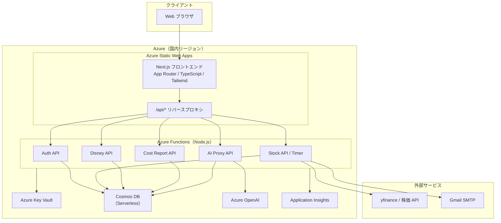
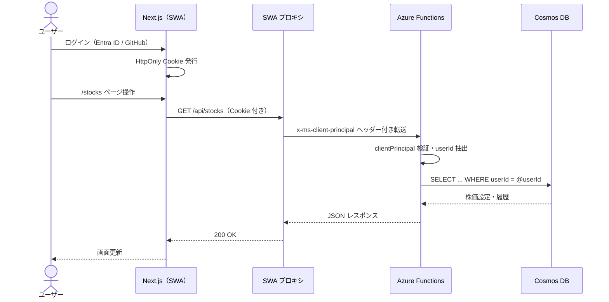
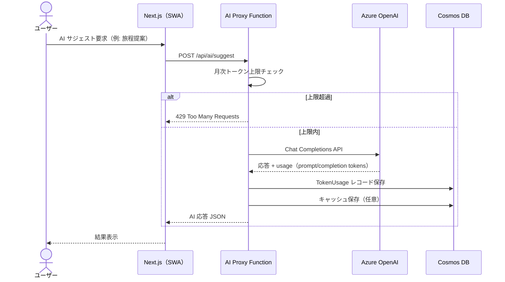
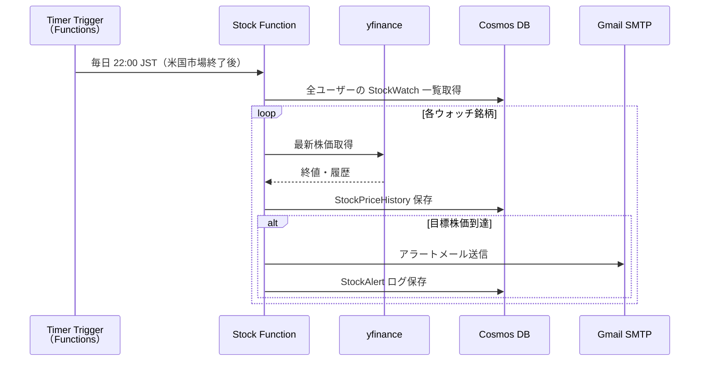
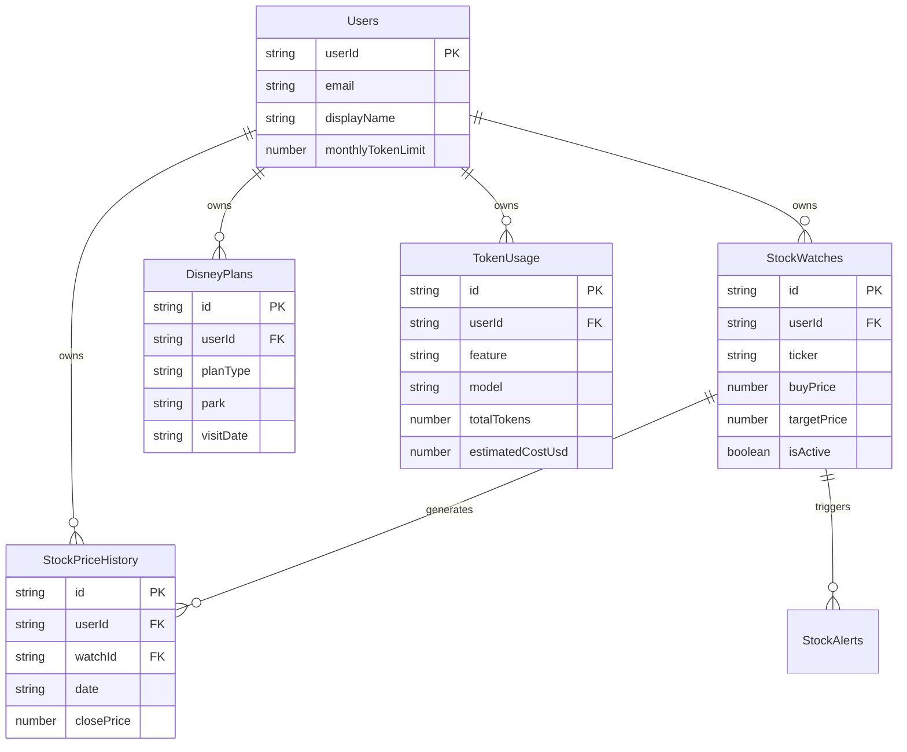

# システム設計書

> 最終更新: 2026-07-31  
> 対象リポジトリ: ClaudeCodeWork  
> プロジェクトルール: `.claudecode.json` を参照

---

## 目次

1. [システム概要](#システム概要)
2. [技術スタック](#技術スタック)
3. [非機能要件](#非機能要件)
4. [アーキテクチャ構成図](#アーキテクチャ構成図)
5. [データ設計](#データ設計)
6. [現状実装と今後の拡張](#現状実装と今後の拡張)

---

## システム概要

### 目的

本システムは、個人向けの統合ダッシュボードおよび自動化基盤である。  
Azure 上のサーバーレス構成を採用し、以下のドメインを単一の認証基盤のもとで提供する。

| ドメイン | 概要 |
|---|---|
| **認証** | ユーザー識別・セッション管理。全機能の共通ゲートウェイ |
| **米国株** | 米国株の価格取得・分析・目標株価アラート |
| **ディズニー** | ディズニーリゾート関連情報（パーク予定・チケット・メモ等）の管理 |
| **コストレポート** | Azure OpenAI トークン消費量の集計・可視化・コスト試算 |

---

## 技術スタック

プロジェクトの固定ルールは `.claudecode.json` に定義する。以下はその要約。

| レイヤー | 技術 | 備考 |
|---|---|---|
| **フロントエンド** | Next.js（App Router）+ TypeScript + Tailwind CSS | Azure Static Web Apps（`swa-personal-apps-prod`）にデプロイ |
| **バックエンド** | Azure Functions（Node.js / Serverless） | Consumption プラン、`/api/*` で SWA からプロキシ |
| **データベース** | Azure Cosmos DB（Serverless） | パーティションキー `userId` |
| **AI** | Azure OpenAI Service | AI Proxy Function 経由で呼び出し |

### フロントエンド構成（Next.js）

```
frontend/
├── app/                  # App Router（ページ・レイアウト）
│   ├── layout.tsx        # 共通レイアウト
│   ├── page.tsx          # ダッシュボード TOP
│   ├── stocks/           # 米国株画面
│   ├── disney/           # ディズニー画面
│   └── costs/            # コストレポート画面
├── components/           # 共通 UI コンポーネント
├── lib/                  # API クライアント・ユーティリティ
└── tailwind.config.ts
```

- **App Router**: ファイルベースルーティング。Server Components をデフォルトとし、インタラクティブ UI のみ `"use client"` を付与
- **TypeScript**: 全ソースを TypeScript で記述。API レスポンス型は `lib/types/` に集約
- **Tailwind CSS**: スタイリングは Tailwind ユーティリティクラスを使用。カスタムテーマは `tailwind.config.ts` で定義
- **SWA 連携**: `staticwebapp.config.json` で認証ルールと `/api/*` プロキシを設定。API 呼び出しは同一オリジンの `/api/...` 経由（Cookie 自動送信）

### Azure リソース命名規則

| リソース | 名前 |
|---|---|
| リソースグループ | `rg-personal-apps-prod` |
| Static Web App | `swa-personal-apps-prod` |

### 主要機能

#### 1. 認証（Authentication）

- Azure Static Web Apps（SWA）組み込み認証（Microsoft Entra ID / GitHub 等）を利用
- Next.js フロントエンドから Azure Functions への API 呼び出しは SWA が付与する `x-ms-client-principal` ヘッダーでユーザー識別
- セッション管理は SWA 組み込み認証の HttpOnly Cookie を使用（クライアント JS からトークンを直接扱わない）
- バックエンドは `userId` をパーティションキーとして Cosmos DB と紐付け

#### 2. 米国株（US Stocks）

- 外部 API（yfinance 等）から米国株の終値・移動平均を取得
- 購入価格・目標株価（倍率）をユーザー設定として保持
- 目標到達時にメール通知（現状: `stock.py` によるローカル実行プロトタイプ）
- 将来: Functions のタイマートリガーで定期実行し、結果を Cosmos DB に保存

#### 3. ディズニー（Disney）

- パーク訪問予定日・エリア・同行者メモの登録・一覧表示
- チケット種別・購入日・有効期限の管理
- 将来的に AI による旅程サジェスト（Azure OpenAI 連携）を想定

#### 4. コストレポート（Cost Report）

- Azure OpenAI へのリクエストごとにトークン使用量（prompt / completion）を記録
- 月次・機能別の集計ダッシュボードを Next.js 画面（`/costs`）で表示
- コスト極小化のため、使用量上限アラートおよびモデル選択の記録を行う

---

## 非機能要件

### セキュリティ方針

| 項目 | 方針 |
|---|---|
| **認証・認可** | SWA 組み込み認証 + HttpOnly Cookie + Functions 側での `clientPrincipal` 検証。未認証リクエストは 401 を返却 |
| **通信** | すべて HTTPS。Next.js（SWA）→ Functions は同一 SWA アプリ内の `/api/*` プロキシ経由 |
| **秘密情報** | API キー・接続文字列は環境変数または Azure Key Vault に格納。コードへの直書きは禁止。Functions は Managed Identity で Key Vault を参照 |
| **データ分離** | Cosmos DB のパーティションキーを `userId` とし、他ユーザーのデータへのアクセスを防止 |
| **入力検証** | Functions 入口でリクエストボディ・クエリパラメータをバリデーション |
| **監査** | 認証失敗・異常な API 呼び出しは Application Insights に記録 |

### コスト極小化のルール

| ルール | 詳細 |
|---|---|
| **サーバーレス優先** | すべて Free 枠または Serverless / Consumption プランを選択し、待機コストを 0 円に抑える |
| **プラン選定** | Azure Functions（Consumption）、Cosmos DB（Serverless）、SWA（Free/Standard）、Azure OpenAI（従量課金） |
| **AI 呼び出し最小化** | キャッシュ可能な応答は Cosmos DB に保存し、同一プロンプトの再実行を避ける |
| **タイマー実行の間引き** | 株価取得は市場時間外はスキップ。ディズニー通知は日次 1 回に限定 |
| **Cosmos DB RU 抑制** | ポイント読み取りを優先。全件スキャンを避け、必要なパーティションのみクエリ |
| **ログ保持期間** | Application Insights の保持期間を 30 日に設定 |
| **環境分離** | 開発環境は本番リソースを共有せず、Functions の `--dry-run` フラグで外部 API 呼び出しを抑制可能にする |
| **トークン上限** | ユーザーあたり月次トークン上限を設定し、超過時は AI 機能を一時停止 |

### データ国内保持（リージョン制約）

> **すべてのユーザーデータ、プロンプト、ログは日本国内リージョン（`Japan East` / `Japan West`）に保持する。海外リージョンへのデータ転送は禁止。**

| リソース | リージョン | 備考 |
|---|---|---|
| Azure Static Web Apps | East Asia または Japan East 相当 | SWA はグローバル CDN 配信だが、API バックエンドは国内リージョンに固定 |
| Azure Functions | **Japan East** または **Japan West** | Node.js / Consumption プラン |
| Azure Cosmos DB | **Japan East** または **Japan West** | Serverless、単一リージョン書き込み |
| Azure OpenAI | **Japan East** | GPT-4o mini 等、利用可能モデルに限定 |
| Azure Key Vault | **Japan East** または **Japan West** | シークレット管理 |
| Application Insights | **Japan East** または **Japan West** | ログ・メトリクス |

- バックアップ・レプリケーションは同一国内リージョン内のみ。海外リージョンへのフェイルオーバーは行わない
- 外部 API（yfinance 等）への outbound 通信はデータ保存を伴わない参照のみ許可

---

## アーキテクチャ構成図

### システム全体構成



### 認証付き API リクエスト（シーケンス）



### AI コスト記録フロー（シーケンス）



### 株価アラート定期実行（シーケンス）



---

## データ設計

Cosmos DB は **Serverless モード**、コンテナ単位でパーティションキー `userId` を統一する。

### コンテナ一覧

| コンテナ名 | パーティションキー | 用途 |
|---|---|---|
| `Users` | `/userId` | ユーザープロファイル |
| `StockWatches` | `/userId` | 株価ウォッチ設定 |
| `StockPriceHistory` | `/userId` | 株価履歴 |
| `DisneyPlans` | `/userId` | ディズニー予定・チケット |
| `TokenUsage` | `/userId` | AI トークン消費履歴 |

---

### Users（ユーザー管理）

| フィールド | 型 | 必須 | 説明 |
|---|---|---|---|
| `id` | string | ✓ | Cosmos DB ドキュメント ID（= `userId`） |
| `userId` | string | ✓ | SWA `clientPrincipal.userId`（パーティションキー） |
| `email` | string | ✓ | ログインメールアドレス |
| `displayName` | string | | 表示名 |
| `authProvider` | string | ✓ | 認証プロバイダ（`aad` / `github` 等） |
| `notifyEmail` | string | | 通知先メール（未設定時は `email` を使用） |
| `monthlyTokenLimit` | number | ✓ | 月次 AI トークン上限（デフォルト: 100,000） |
| `createdAt` | string (ISO 8601) | ✓ | 登録日時 |
| `updatedAt` | string (ISO 8601) | ✓ | 最終更新日時 |

**サンプル JSON**

```json
{
  "id": "abc123",
  "userId": "abc123",
  "email": "user@example.com",
  "displayName": "Mickey",
  "authProvider": "aad",
  "notifyEmail": "user@example.com",
  "monthlyTokenLimit": 100000,
  "createdAt": "2026-07-31T00:00:00+09:00",
  "updatedAt": "2026-07-31T00:00:00+09:00"
}
```

---

### StockWatches / StockPriceHistory（米国株・拡張案）

#### StockWatches — ウォッチ設定

| フィールド | 型 | 必須 | 説明 |
|---|---|---|---|
| `id` | string | ✓ | ドキュメント ID（UUID） |
| `userId` | string | ✓ | パーティションキー |
| `ticker` | string | ✓ | 銘柄コード（例: `TSLA`） |
| `buyPrice` | number | ✓ | 購入価格（USD） |
| `targetMultiplier` | number | ✓ | 目標倍率（例: 1.3） |
| `targetPrice` | number | ✓ | 目標株価（`buyPrice × targetMultiplier`） |
| `isActive` | boolean | ✓ | 監視有効フラグ |
| `createdAt` | string | ✓ | 登録日時 |

#### StockPriceHistory — 株価履歴

| フィールド | 型 | 必須 | 説明 |
|---|---|---|---|
| `id` | string | ✓ | ドキュメント ID |
| `userId` | string | ✓ | パーティションキー |
| `watchId` | string | ✓ | `StockWatches.id` への参照 |
| `ticker` | string | ✓ | 銘柄コード |
| `date` | string | ✓ | 取得日（YYYY-MM-DD） |
| `closePrice` | number | ✓ | 終値（USD） |
| `ma5` | number | | 5 日移動平均 |
| `ma25` | number | | 25 日移動平均 |
| `changePct` | number | | 前日比（%） |
| `trend` | string | | `bullish` / `bearish` |
| `fetchedAt` | string | ✓ | 取得日時 |

#### StockAlerts — アラートログ（任意）

| フィールド | 型 | 必須 | 説明 |
|---|---|---|---|
| `id` | string | ✓ | ドキュメント ID |
| `userId` | string | ✓ | パーティションキー |
| `watchId` | string | ✓ | ウォッチ設定 ID |
| `ticker` | string | ✓ | 銘柄コード |
| `triggerPrice` | number | ✓ | アラート発火時株価 |
| `targetPrice` | number | ✓ | 目標株価 |
| `notifiedAt` | string | ✓ | 通知日時 |

---

### DisneyPlans（ディズニー・拡張案）

| フィールド | 型 | 必須 | 説明 |
|---|---|---|---|
| `id` | string | ✓ | ドキュメント ID |
| `userId` | string | ✓ | パーティションキー |
| `planType` | string | ✓ | `visit`（訪問予定）/ `ticket`（チケット）/ `memo`（メモ） |
| `park` | string | | パーク名（`TDL` / `TDS`） |
| `visitDate` | string | | 訪問予定日（YYYY-MM-DD） |
| `title` | string | ✓ | タイトル |
| `description` | string | | 詳細メモ |
| `ticketType` | string | | チケット種別（1-Day Passport 等） |
| `purchaseDate` | string | | 購入日 |
| `expiryDate` | string | | 有効期限 |
| `companions` | string[] | | 同行者リスト |
| `createdAt` | string | ✓ | 登録日時 |
| `updatedAt` | string | ✓ | 最終更新日時 |

**サンプル JSON（訪問予定）**

```json
{
  "id": "disney-001",
  "userId": "abc123",
  "planType": "visit",
  "park": "TDL",
  "visitDate": "2026-12-25",
  "title": "クリスマスパレード",
  "description": "15:00 ショー優先",
  "companions": ["家族"],
  "createdAt": "2026-07-31T00:00:00+09:00",
  "updatedAt": "2026-07-31T00:00:00+09:00"
}
```

---

### TokenUsage（トークン履歴・コストレポート）

| フィールド | 型 | 必須 | 説明 |
|---|---|---|---|
| `id` | string | ✓ | ドキュメント ID |
| `userId` | string | ✓ | パーティションキー |
| `feature` | string | ✓ | 機能識別子（`disney-suggest` / `stock-analysis` 等） |
| `model` | string | ✓ | 使用モデル（例: `gpt-4o-mini`） |
| `promptTokens` | number | ✓ | 入力トークン数 |
| `completionTokens` | number | ✓ | 出力トークン数 |
| `totalTokens` | number | ✓ | 合計トークン数 |
| `estimatedCostUsd` | number | | 推定コスト（USD） |
| `requestId` | string | | Azure OpenAI リクエスト ID |
| `createdAt` | string | ✓ | リクエスト日時 |

**月次集計クエリ例（Cosmos DB SQL）**

```sql
SELECT
  c.feature,
  SUM(c.totalTokens) AS totalTokens,
  SUM(c.estimatedCostUsd) AS totalCostUsd
FROM c
WHERE c.userId = @userId
  AND c.createdAt >= @monthStart
  AND c.createdAt < @monthEnd
GROUP BY c.feature
```

---

### ER 概略図



---

## 現状実装と今後の拡張

### 現状（2026-07-31 時点）

| コンポーネント | 状態 | 備考 |
|---|---|---|
| 米国株ローカルスクリプト | **実装済** | `stock.py` — TSLA の移動平均分析・目標株価 Gmail 通知 |
| Next.js フロントエンド | 未実装 | App Router + TypeScript + Tailwind CSS。SWA（`swa-personal-apps-prod`）へデプロイ予定 |
| Azure Functions | 未実装 | Node.js / Serverless。各ドメイン API + タイマートリガー |
| Cosmos DB | 未実装 | 上記データ設計に基づきコンテナ作成 |
| Azure OpenAI 連携 | 未実装 | AI Proxy Function 経由 |
| 認証 | 未実装 | SWA 組み込み認証 |
| ディズニー機能 | 未実装 | `DisneyPlans` コンテナ利用 |
| コストレポート | 未実装 | `TokenUsage` コンテナ利用 |

### 推奨実装順序

1. **Next.js プロジェクト初期化** — App Router + TypeScript + Tailwind CSS、`staticwebapp.config.json` 設定
2. **認証基盤** — SWA + Entra ID 設定、Functions（Node.js）での `clientPrincipal` 検証 middleware
3. **Cosmos DB セットアップ** — Japan East / Serverless、`Users` コンテナ
4. **米国株 Functions 化** — `stock.py` ロジックを Node.js Timer Trigger + Stock API に移植
5. **コストレポート** — AI Proxy 実装と同時に `TokenUsage` 記録を組み込み、`/costs` 画面を追加
6. **ディズニー機能** — CRUD API + `/disney` 画面
7. **AI サジェスト** — ディズニー旅程提案等、トークン上限ガード付き

---

## 関連ファイル

| ファイル | 説明 |
|---|---|
| `.claudecode.json` | プロジェクト固定ルール（アーキテクチャ・制約・命名規則） |
| `stock.py` | 米国株分析・Gmail 通知プロトタイプ（TSLA / 目標 1.3 倍） |
| `docs/DESIGN.md` | 本設計書 |
