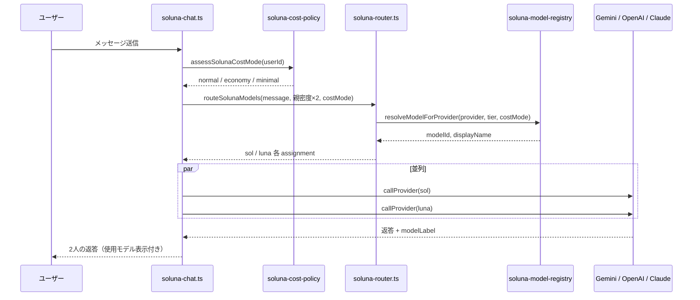

# Soluna — 最新 AI モデル自動判断フレームワーク

Soluna（ソルーナ）は、**ソル（Sol）** と **ルーナ（Luna）** という2人の AI コンパニオンが、ユーザーの育成・記憶・性格を保ったまま、**OpenAI / Claude / Gemini** の最新利用可能モデルを自動選択して応答する仕組みです。

> 関連コード: `frontend/lib/server/soluna-router.ts`, `soluna-model-registry.ts`, `soluna-cost-policy.ts`, `soluna-chat.ts`

---

## 1. 設計思想 — 何を固定し、何を変えるか

| 固定（変えない） | 自動判断（変える） |
|---|---|
| ソル・ルーナの **性格・話し方**（ペルソナ） | 各返答で使う **プロバイダ**（Gemini / Azure OpenAI / Claude） |
| Cosmos DB の **記憶**（目標・感情・体調など） | プロバイダ内の **具体モデル / デプロイ名** |
| 親密度・ステージ（黎明〜至陽 / 新月〜スーパームーン） | **知能 Lv.1〜3** に応じた tier（budding / growing / mature） |
| 2人同時応答・Apple Watch 連携など UX | 月間コストが高いときの **ダウングレード** |

**フレームワーク** としての位置づけ:

- 新しい GPT / Claude / Gemini が Azure や env に追加されても、**カタログ + 環境変数** を更新するだけで Soluna 全体が追随できる
- キャラクター体験（記憶・育成・口調）はモデルが変わっても一貫する

---

## 2. 全体フロー（1 回のチャット）

処理は **追加の AI 呼び出しなし**（ルーティングはキーワード正規表現のみ）で、ソル・ルーナの API 呼び出しは **並列** のままです。

---

## 3. レイヤー構成

### 3.1 プロバイダルーティング（`soluna-router.ts`）

**目的**: 質問内容に応じて、ソル・ルーナに **異なるプロバイダ** を割り当てる。

**スコアリング**（`scoreProvider`）:

- 各プロバイダにキーワード一致で加点
- コストモード時は `costBiasForProvider` で Gemini 優先 / 高コストプロバイダ減点
- 最高スコアのプロバイダを選択
- **ルーナは必ずソルと別プロバイダ**（被った場合は代替を強制）

#### キーワード一覧

| キャラ | プロバイダ | キーワード例 | 意図 |
|---|---|---|---|
| ソル | Gemini | 目標, タスク, 計画, 行動, 習慣, 達成… | 即応・行動伴走 |
| ソル | Claude | なぜ, 意味, 戦略, 判断, 分析, 本質… | 深い整理・判断支援 |
| ルーナ | Claude | 感情, 不安, 疲れ, 悩み, 共感, 辛い… | 感情・内省の受け止め |
| ルーナ | OpenAI | 体調, 健康, 睡眠, 食事, 病院… | 安定した共感・コンディション |
| 両方 | Claude（加点） | なぜ, 意味, 哲学, 内省, 人生… | 内省的な問い |

スコアが低い（≈ デフォルト）場合は、キャラクターごとの **デフォルト理由**（例: ソル→Gemini 行動系、ルーナ→OpenAI 安定共感）が使われます。

### 3.2 モデルレジストリ（`soluna-model-registry.ts`）

**目的**: プロバイダが決まったあと、**その中で最新かつ利用可能なモデル** を選ぶ。

#### カタログ（`MODEL_CATALOG`）

各候補には以下を定義:

- `modelId` — デプロイ名 / モデル ID（例: `council-gpt5`, `claude-sonnet-5`）
- `displayName` — UI 表示名
- `costClass` — free / low / medium / high / premium
- `minTier` — budding / growing / mature（知能 Lv. 下限）
- `priority` — 大きいほど「新しさ・高性能」優先

#### 選択アルゴリズム（`resolveModelForProvider`）

1. 環境変数から **設定済みデプロイ名** を収集（`SOLUNA_*`, `AZURE_*`, `GEMINI_*` 等）
2. フィルタ:
   - プロバイダが設定済み
   - 親密度 tier ≥ `minTier`
   - コストモード上限以内（後述）
   - env に存在する / Foundry 設定と整合
3. `priority` 降順で先頭を選択
4. 実際の API 呼び出し名は `resolveDeploymentName` で env デプロイ名に解決

**新モデル追加時**: カタログに 1 行追加 + SWA env にデプロイ名を設定するだけで、コード変更を最小化できます。

### 3.3 成長 tier（知能 Lv.）

親密度から tier を決定（`resolveGrowthTier`）:

| 親密度 | tier | 知能 Lv. |
|---|---|---|
| 0–40 | budding | Lv.1 |
| 41–80 | growing | Lv.2 |
| 81–100 | mature | Lv.3 |

tier が高いほど `minTier` の高い（高性能）モデルが選択可能になります。

### 3.4 コストポリシー（`soluna-cost-policy.ts`）

月間推定コスト（USD）とトークン使用率から **costMode** を判定:

| costMode | 条件（デフォルト） | 効果 |
|---|---|---|
| `normal` | 通常 | 最新・ premium まで選択可 |
| `economy` | 月 $8+ または使用率 65%+ | tier を 1 段下げ、high 以下に制限 |
| `minimal` | 月 $20+ または使用率 85%+ | tier を budding 固定、low 以下、Gemini 優先バイアス |

環境変数: `SOLUNA_COST_ECONOMY_USD`, `SOLUNA_COST_MINIMAL_USD`, `SOLUNA_COST_ECONOMY_RATIO`, `SOLUNA_COST_MINIMAL_RATIO`

---

## 4. プロンプト — モデルごとの書き方の違いをどう扱うか

### 4.1 方針: **統一ペルソナ + プロバイダ別アダプタ**

Soluna は **モデルごとに別プロンプトを書いていません**。代わりに:

1. **共通の system プロンプト**（`SOL_PERSONA` / `LUNA_PERSONA` + 記憶 + 親密度 + tier 補強）を 1 つ組み立てる
2. **プロバイダ別クライアント**（`callProvider`）が、各 API の形式に合わせて渡し方だけ変える

これにより「ソルらしさ・ルーナらしさ」はモデルが変わっても維持されます。

### 4.2 プロバイダ別の API マッピング

| 項目 | Gemini | Azure OpenAI | Claude (Foundry / 直 API) |
|---|---|---|---|
| system | `system` フィールド | `messages[role=system]` | `system` フィールド |
| 会話履歴 | `user` メッセージ列 | `user` メッセージ列 | **1 つの user メッセージ**に結合 |
| 履歴の渡し方 | 複数 user 可 | 複数 user 可 | transcript を `\n\n` で連結 |
| temperature | Sol 0.75 / Luna 0.8 | 同左 | Luna 0.85（やや高め） |
| max tokens | 2200（Gemini は truncation リトライ） | 350（mature 420） | 350（mature 420） |

#### Claude について

Claude API は multi-turn を assistant ロール付きで渡すのが一般的ですが、Soluna では **短い返答（2〜3 行）** に限定しているため、履歴 + 今回の発言を **単一 user メッセージ** にまとめて渡しています。system にペルソナ・記憶を載せる Anthropic 推奨パターンに沿っています。

#### OpenAI / Gemini について

OpenAI Chat Completions と Gemini の system + user 形式は、そのまま Soluna の構造と整合します。

### 4.3 tier によるプロンプト強化（モデル非依存）

`enhancePersonaForTier` が **知能 Lv.2 / Lv.3** で system に追記:

- Lv.2: 「記憶とのつながりを意識」
- Lv.3: 「より深い洞察と的確な言葉選び」

高性能モデル（Opus, GPT-5 系）と組み合わせて、成長実感を出します。

### 4.4 限界と今後の拡張

現状 **モデル固有のプロンプトチューニング**（例: Claude 向け XML タグ、GPT-5 向け reasoning 指示）は **行っていません**。

理由:

- Soluna の出力は全モデル共通で **80〜150 字・2〜3 行** に制約
- ペルソナ・記憶・短文化ルールが主要な制御軸

必要になった場合は `callProvider` 内で `provider` / `tier` に応じた system 追記を追加する拡張ポイントがあります。

---

## 5. フォールバック

1 プロバイダが失敗した場合:

1. 当初の assignment を試行
2. `listFallbackProviders` でスコア順の代替プロバイダを試行
3. 相手キャラのプロバイダは **blocked**（2人同じ API に依存しない）
4. 成功したモデル名を `modelLabel` として UI / メッセージに保存

---

## 6. UI への反映

- チャット吹き出し: `Azure OpenAI · GPT-5 系 (council-gpt5)` 等
- キャラクターカード: 現在のルート / モデル
- コスト調整中: バナー通知（`costReason`）
- Apple Watch ショートカット: `solModelLabel`, `lunaModelLabel` を JSON で返却

---

## 7. 本番環境変数（抜粋）

| 変数 | 用途 |
|---|---|
| `AZURE_FOUNDRY_CLAUDE_RESOURCE` | Foundry リソース名 |
| `AZURE_FOUNDRY_CLAUDE_API_KEY` | Foundry API キー |
| `SOLUNA_CLAUDE_DEPLOYMENT` / `_FAST` / `_ADVANCED` | Claude デプロイ名 |
| `SOLUNA_LUNA_DEPLOYMENT` / `SOLUNA_OPENAI_DEPLOYMENT_ADVANCED` | Azure OpenAI |
| `SOLUNA_GEMINI_MODEL_*` / `GEMINI_RELAY_*` | Gemini |
| `SOLUNA_COST_*` | コスト調整閾値 |

詳細は [`README_SETUP.md`](./README_SETUP.md) を参照。

---

## 8. ファイル一覧

| ファイル | 役割 |
|---|---|
| `soluna-chat.ts` | エントリ、ペルソナ、プロバイダ呼び出し、並列実行 |
| `soluna-router.ts` | プロバイダ選択、キーワードスコア、2人別プロバイダ強制 |
| `soluna-model-registry.ts` | モデルカタログ、env 解決、最新優先 |
| `soluna-cost-policy.ts` | 月間コスト連動ダウングレード |
| `soluna-model-catalog.ts` | tier 別デフォルト名・ドキュメント用一覧 |
| `anthropic.ts` | Foundry Claude / 直 API クライアント |
| `soluna-store.ts` | メッセージに `modelLabel` 等を永続化 |

---

## 9. まとめ

| 質問 | 回答 |
|---|---|
| 記憶・性格は維持される？ | **はい**。ペルソナ + Cosmos 記憶は全プロバイダ共通の system に載せる |
| 最新モデルは自動？ | **はい**。カタログ priority + env デプロイ + tier + costMode で選択 |
| 問い合わせによる使い分けは？ | **キーワードスコア**でプロバイダ決定。その後レジストリで具体モデル決定 |
| プロンプトはモデル別？ | **基本は統一**。API 形式の差のみアダプタで吸収。モデル固有チューニングは未実施 |
